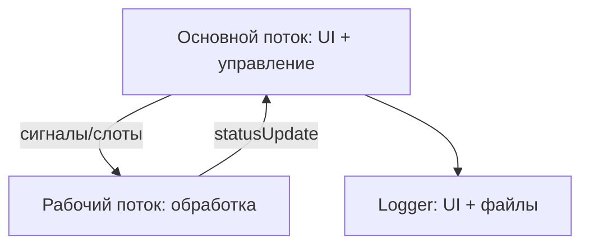

# MegaApp — пакетная XOR-обработка файлов

## 📦 Основные возможности

- **Потоковое XOR‑преобразование**  

- **Два режима запуска**  
  *Разовый* — немедленная обработка; *По таймеру* — циклический автоматический перезапуск задачи через заданный интервал
- **Управление выполнением**  
  Пауза / продолжение / полная остановка задачи в любой момент
- **Разрешение конфликтов имён**  
  Выбор стратегии при совпадении имён выходных файлов: перезапись или добавление числового суффикса (`file_1.txt`, `file_2.txt`).
- **Опциональное удаление исходников**  
- **Прогресс и логирование**  

## 🧱 Архитектура



Worker — выполняет длительную работу в собственном QThread.
Внутри реализован конечный автомат с состояниями (Idle, Running, Paused) и событиями (FileStarted, FileProgress, FileFinished, …).

MainWindow — графический интерфейс, валидация параметров, запуск/остановка задач, отображение статуса и прогресса.

Logger — модуль логирования, поддерживающий вывод в UI и файлы.

## 📁 Структура проекта

```
.
├── CMakeLists.txt                  # Сценарий сборки CMake
├── .gitignore
├── src/
│   ├── config.h                    # Глобальные константы и строки
│   ├── main.cpp                    # Точка входа
│   ├── mainwindow.h / .cpp         # Главное окно, инициализация и логика UI
│   ├── worker.h / .cpp             # Фоновый воркер 
│   ├── logger/
│   │   ├── logger.h / .cpp         # Логирование
│   │   └── loggerConfig.h          # Настройки путей, размеров и количества файлов
│   ├── models/
│   │   ├── taskModel.h             # Структура Task, перечисления режимов
│   │   └── workerModel.h           # Состояния воркера, события, статус выполения задачи
│   └── utils/
│       ├── utils.h / .cpp          # Вспомогательные функции
│   └── ui/
│       └── mainwindow.ui           # Форма главного окна
├── tests/
│   ├── testLogger.h / .cpp         # Модульные тесты Logger
│   └── testWorkerXor.h / .cpp      # Модульные тесты функции wordXor
└── README.md
```

## 🔧 Сборка и запуск

```bash
git clone <репозиторий>
cd MegaApp
mkdir build && cd build
cmake ..
cmake --build .
./MegaApp   # или MegaApp.exe на Windows
```

## 🧪 Тестирование
```bash
mkdir build && cd build
cmake .. -DBUILD_TESTS=ON
cmake --build .
ctest
```
